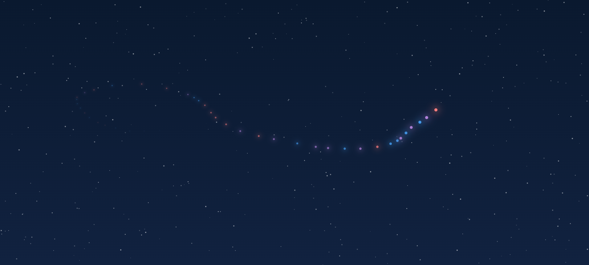

# 🌌 StarlightField

An interactive starfield with a glowing **Aurora Trail** that follows your cursor.  
Built with **React** and **CSS animations**, this project creates a visually stunning and immersive experience.

---

## 📸 Preview / Live Demo
👉 [Live Demo Link](https://interactive-starlight-field.vercel.app/)  


---

## ✨ Features
- 400+ randomly generated stars with twinkling animation ✨
- Aurora trail that dynamically follows your mouse 🪄
- Smooth animations with glowing particle effects
- Fully responsive & lightweight

---

## 🚀 Getting Started

### 1. Clone the Repository
```bash
git clone https://github.com/RohanBhoge/interactive-starlight-field
cd InteractiveStarlightField
